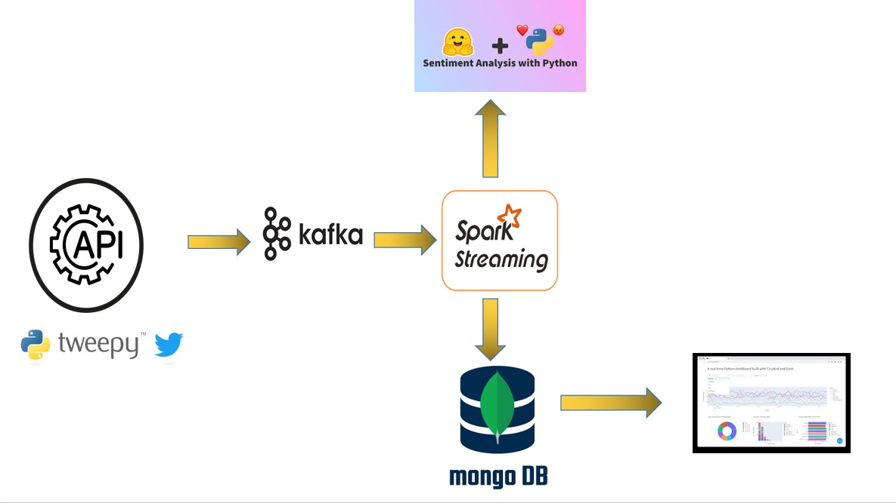
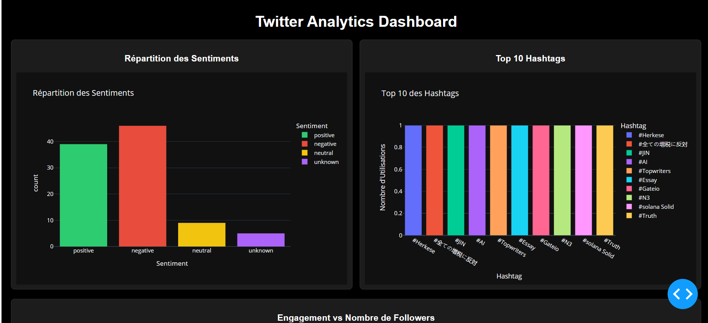

# Analyse des Tendances en Temps Réel avec Kafka, Spark et MongoDB

Ce projet implémente une architecture Big Data pour analyser les tendances en temps réel à partir de tweets. Les données sont collectées via Kafka, traitées par Spark Streaming, et les résultats sont stockés dans MongoDB pour être visualisés dans un tableau de bord interactif.

## Architecture du Projet
L'architecture globale du projet est illustrée ci-dessous :



- **Kafka** : Récupère les tweets et les diffuse sur un topic.
- **Spark Streaming** : Traite les tweets en temps réel pour extraire les tendances.
- **MongoDB** : Stocke les résultats traités.
- **Tableau de bord** : Visualise les résultats.

## Prérequis
Avant de commencer, assurez-vous que les outils suivants sont installés sur votre machine :

- **Docker et Docker Compose**
- **Python 3.11**
- **Scala 3** et **sbt** (Simple Build Tool)
- **Java JDK 8 ou supérieur**

## Instructions d'Exécution

### 1. Lancer les Conteneurs Docker

Exécutez la commande suivante pour démarrer tous les services nécessaires, notamment Kafka, Spark et MongoDB :
```bash
cd <project_directory>
docker-compose up -d
```

### 2. Démarrer le Producteur Kafka
Configurez un producteur Kafka pour diffuser les tweets sur le topic `tweet_topic` :
```bash
cd KAFKA
python kafka-producer.py
```

### 3. Compiler et Packager le Code Scala
Compilez le code Scala et créez un fichier JAR pour l'application Spark Streaming :
```bash
cd SPARK
sbt clean compile
sbt package
```

Cela générera un fichier JAR dans le répertoire `target/scala-3.x/`. Renommez-le en `spark_2.12-0.1.jar`.

### 4. Copier le Fichier JAR dans Spark Master
Transférez le fichier JAR dans le conteneur Spark Master :
```bash
cd <project_directory>
docker cp ./SPARK/target/scala-3.x/spark_2.12-0.1.jar spark_master:/opt/bitnami/spark
```

### 5. Exécuter l'Application Spark Streaming
Soumettez l'application Spark au cluster pour commencer le traitement en temps réel :
```bash
docker exec -it spark_master /bin/bash
spark-submit \
    --master spark://spark-master:7077 \
    --packages org.apache.spark:spark-sql-kafka-0-10_2.12:3.3.0,org.mongodb.spark:mongo-spark-connector_2.12:10.2.1 \
    --class KafkaSparkConsumer \
    /opt/bitnami/spark/spark_2.12-0.1.jar
```

### 6. Démarrer le Tableau de Bord
Accédez à votre tableau de bord interactif pour visualiser les tendances en temps réel :
```bash
cd DASHBOARD
python dashboard.py
```

Le tableau de bord sera accessible à l'adresse `http://localhost:8050`.


### 7. Surveiller les Résultats dans MongoDB
Les tweets traités sont enregistrés dans la collection MongoDB `tweetCollection`. Vous pouvez les consulter en accédant à MongoDB :
```bash
docker exec -it mongodb mongosh
```
Une fois connecté, exécutez les commandes suivantes :
```bash
use tweetDB
db.tweetCollection.find()
```

